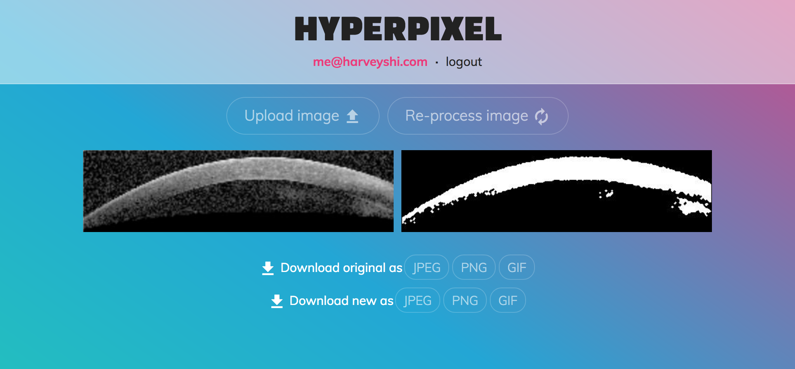

# HYPERPIXEL
## Corneal Image Segmentation Web Service

[](https://travis-ci.org/rvshi/ImageProcessorS18) [](http://imageprocessors18.readthedocs.io/en/latest/?badge=latest)

__Team:__ 59ers

__Team Members:__ Harvey Shi (@rvshi), Edward Liang (@edl11), Michelle Wei (@michellewei04)

__Course:__ Duke BME 590-05 Medical Software Design (Spring 2018)


 
 

## Introduction

Hyperpixel is web service for segmenting corneal images using [Otsu's Method](https://en.wikipedia.org/wiki/Otsu's_method).
- Hyperpixel provides a backend API for user login, uploading, processing, and downloading images.
- The API is authenticated via JSON web tokens.
- The backend connects to a database for keeping track of users.
- The most recently uploaded and processed images are saved on the server.
- A frontend website is also included, which leverages all the API endpoints.

## Under the hood
### Backend
- Consists of a Flask server and MongoDB database running via [Docker Compose](https://docs.docker.com/compose/).
- Caches the most recent image for each user.
- Segmentation using Otsu's method is carried out via [SciPy](https://www.scipy.org).
- Request validation is handled by [jsonschema](https://pypi.org/project/jsonschema/).
### Frontend
- A static website built using [React](https://reactjs.org/).
- Responsive custom CSS.
- [Axios](https://github.com/axios/axios) for requests.
- [react-gh-pages](https://github.com/gitname/react-gh-pages) for deployment.


## Usage
### Backend
- First, install [Docker](https://docs.docker.com/install/) and [Docker Compose](https://docs.docker.com/compose/install/).
- Create a file called `secret_key.py` in the `backend/` directory with the following contents (make sure to change the SECRET_KEY variable):

```python
SECRET_KEY = 'exampleKey'
```

- The latter file is for the JWT generation process.
- Run `docker-compose up -d` in the repo root directory to begin running the service (both backend and database).
- Type `docker ps` to check that the backend and database are running.
### Frontend
- First, navigate to the `frontend/` folder.
- To test the website locally, run `npm run start`.
- Note, you may want to change the `baseURL` variable in [requests.js](frontend/src/requests.js) to point to your backend URL.
- To build the site for production, run `npm run build`. The production files will be in the `build/` directory.
  - You can then serve the files statically.
